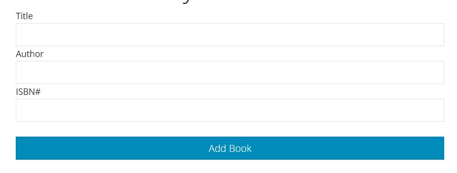

# Steps

1. Cao 8 paskaita OOP Inkapsuliacija
2. isvalyti inputus kai pridejom knyga 
3. neleisti prideti tuscios knygos 
4. po AddBook mygtuku prideti reset mygtuka kuris i musu knygas irasys sita masyva
5. prideti rikiavima pagal title, arba pagal kiekviena stulpeli

```js
[
  {
    title: 'Book One',
    author: 'John Doe',
    isbn: 3434434,
  },
  {
    title: 'Book Two',
    author: 'Jane Doe',
    isbn: 111111,
  },
  {
    title: 'Book Tryys',
    author: 'Serbentautas Doe',
    isbn: 222222,
  },
];
```
